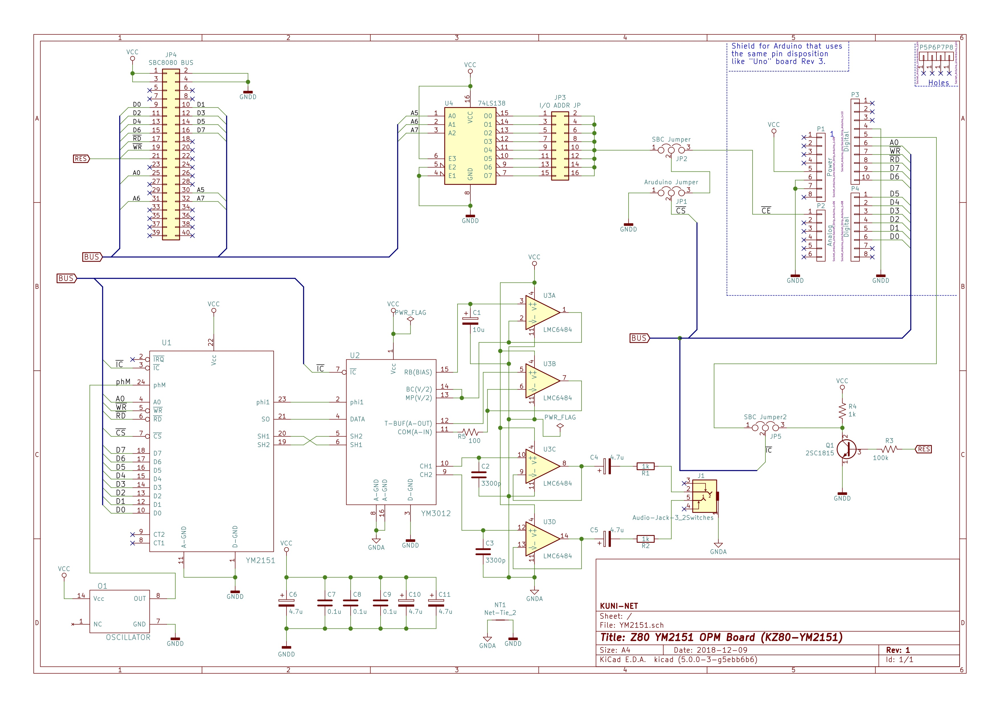

# Z80マイコン FM音源(YM2151)ボード (KZ80-YM2151)

- SBC8080バスにつながるFM音源ボード KZ80-YM2151 のデータ類です。
- 詳しい説明は以下のwikiを参照してください。
  - https://github.com/kuninet/Z80_YM2151/wiki

## 回路図

[PDF版の回路図はこちら](img/YM2151.pdf)

## 部品表

- 部品表は以下にあります。
  - [https://github.com/kuninet/Z80_YM2151/blob/master/KiCAD/YM2151.ods](https://github.com/kuninet/Z80_YM2151/blob/master/KiCAD/YM2151.ods)

## 演奏プログラム&サンプルデータ

- Z80用演奏プログラムとサンプルデータはsample_musicディレクトリにあります。
  - サンプル音楽は参考リンクの音楽データをもとに作成させていただきました。
- 起動方法
  1. sample_music/hexFilesの以下のインテルHex形式ファイルを機械語モニタ等でロード
      - KZ80_YM2151.hex  (8000h番地〜)
      - sample_m.hex    (9000h番地〜)
  2. 8000番地から実行してください。

## 注意点

- 接続方法が複数あり、ジャンパ設定が複雑です。[wiki](https://github.com/kuninet/Z80_YM2151/wiki)をご覧ください。

## ライセンス

- 本リポジトリのデータは MIT License のもとで公開します。

## 参考リンク
- github h1romas4/arduino-vgmplayer
  - https://github.com/h1romas4/arduino-vgmplayer
